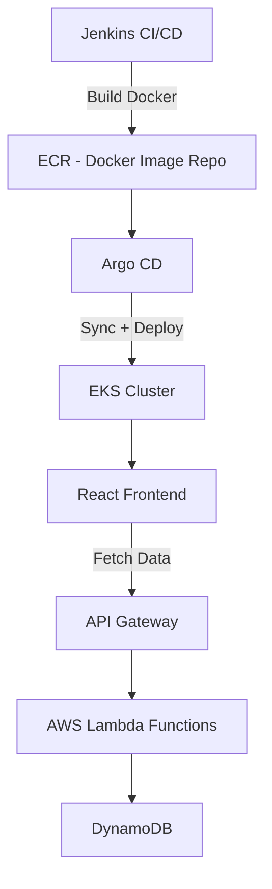

# 🌩️ CloudOpsX – Intelligent Inventory Monitoring Dashboard

**CloudOpsX** is a fully cloud-native inventory analytics platform that enables businesses to **track inventory, visualize stock trends, monitor suppliers, and receive proactive alerts** — all through a beautiful and interactive dashboard.

Built with the power of **AWS, React, Kubernetes, Terraform, and full CI/CD automation**, this project showcases advanced cloud engineering and DevOps principles in action.

> 🎯 Real-time data • Serverless APIs • Scalable Infrastructure • CI/CD Automation • Modern UI

---

## 🧠 Key Features

| 🔍 Feature              | 💬 Description                                                                 |
|------------------------|-------------------------------------------------------------------------------|
| 📊 **Dynamic Charts**   | 5+ real-time charts: Bar (category), Pie (stock), Donut (supplier), Scatter (price vs qty), Line (trend) |
| 🔔 **Smart Alerts**     | Auto-detect low inventory and trigger alert banners or messages               |
| ☁️ **Cloud-Native**     | Built on AWS Lambda, API Gateway, DynamoDB, EKS, S3 with Terraform            |
| ⚙️ **DevOps Automation**| Jenkins CI builds → Docker image pushed to ECR → Argo CD auto-deploys to EKS |
| 🎨 **Professional UI**  | Clean React UI using Chart.js + Tailwind CSS with dark mode support           |
| 🔐 **Security Focused** | IAM best practices, `.env.example`, and secrets managed securely              |

---

## 🖼️ Live Demo (Optional)

> 🔗 Coming Soon — Deployed on EKS via Argo CD, fronted by an AWS Load Balancer

---

## 🧱️ Architecture Diagram



---

## 🛠️ Tech Stack

| Layer             | Tools & Services                                                 |
|------------------|------------------------------------------------------------------|
| **Frontend**      | React.js, Chart.js, Tailwind CSS                                 |
| **Backend**       | AWS Lambda (python), API Gateway                                |
| **Database**      | DynamoDB                                                         |
| **Infrastructure**| Terraform, IAM, VPC, CloudWatch, EKS                             |
| **CI/CD**         | Jenkins, Docker, ECR, GitHub, Argo CD                            |
| **Optional Auth** | AWS Cognito                                                      |

---

## 📁 Project Structure

```bash
cloudopsx-dashboard/
├── backend/               # AWS Lambda functions (API handlers)
├── frontend/              # React dashboard + Chart.js components
├── terraform/             # IaC: VPC, EKS, DynamoDB, API Gateway setup
├── docker/                # Dockerfile (multi-stage build for frontend)
├── jenkins/               # Jenkins CI/CD pipeline scripts
├── demo/                  # Screenshots and assets for presentation
└── README.md
```

---

## 🚀 Local Development

### 🔧 Frontend (React)

```bash
git clone https://github.com/Simran-Kaur1996/cloudopsx-dashboard.git
cd cloudopsx-dashboard/frontend
npm install
npm start
```

### 🧠 Backend (Lambda + API Gateway)

- Lambda functions are located in `backend/`
- Deploy via **AWS Console** or automate with **Terraform**

---

## ⚙️ Infrastructure Setup – Terraform

```bash
cd terraform
terraform init
terraform apply
```

> Provisions:
> - VPC, Subnets, IAM Roles
> - DynamoDB, Lambda, API Gateway
> - EKS Cluster with Node Group

---

## 🐳 Docker & CI/CD Pipeline

### 🛠️ Build Frontend Docker Image

```bash
cd frontend
docker build -t cloudopsx-frontend .
```

### 🚀 Jenkins → GitHub → Argo CD

1. Jenkins builds Docker image and pushes to ECR  
2. Deployment YAML is updated with the new image tag  
3. GitHub repo gets the commit  
4. Argo CD auto-syncs and deploys to EKS 🎯  

---

## ✅ Advanced Features

- 📈 **Real-time Data**: Live charts from DynamoDB with Lambda APIs  
- ⚠️ **Low Stock Alerts**: Highlight understocked products  
- 🧩 **Modular Lambda Functions** for API endpoints  
- 🖥️ **Responsive UI** with dark mode and alert cards  
- 🔄 **Argo CD GitOps** auto-syncs new deployments  

---

## 🔐 Security & Best Practices

- `.env.example` included – **never commit secrets**
- Secrets managed via **GitHub Actions / AWS Parameter Store**
- IAM roles follow **least privilege principle**
- `.gitignore` updated for secure workflows

---

## 🤝 Let's Connect!

💼 This project showcases production-grade experience in:
- Cloud Architecture
- DevOps Automation
- React Frontend Development
- Serverless APIs & Infrastructure-as-Code

📬 Reach out on [LinkedIn](https://www.linkedin.com/in/Simran-Kaur1996)  
📁 GitHub Profile: [@Simran-Kaur1996](https://github.com/Simran-Kaur1996)

---

> 🌟 **CloudOpsX** isn’t just a dashboard—it's a real-world proof of cloud, frontend, and DevOps mastery.
